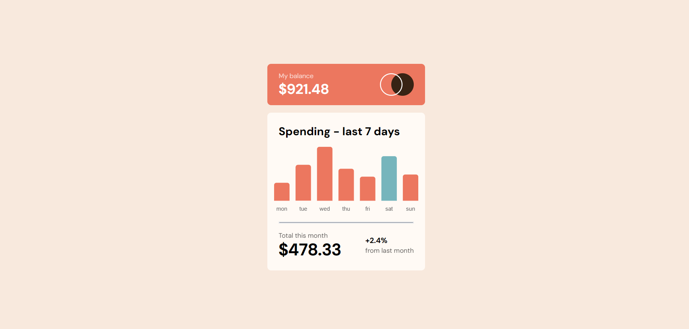
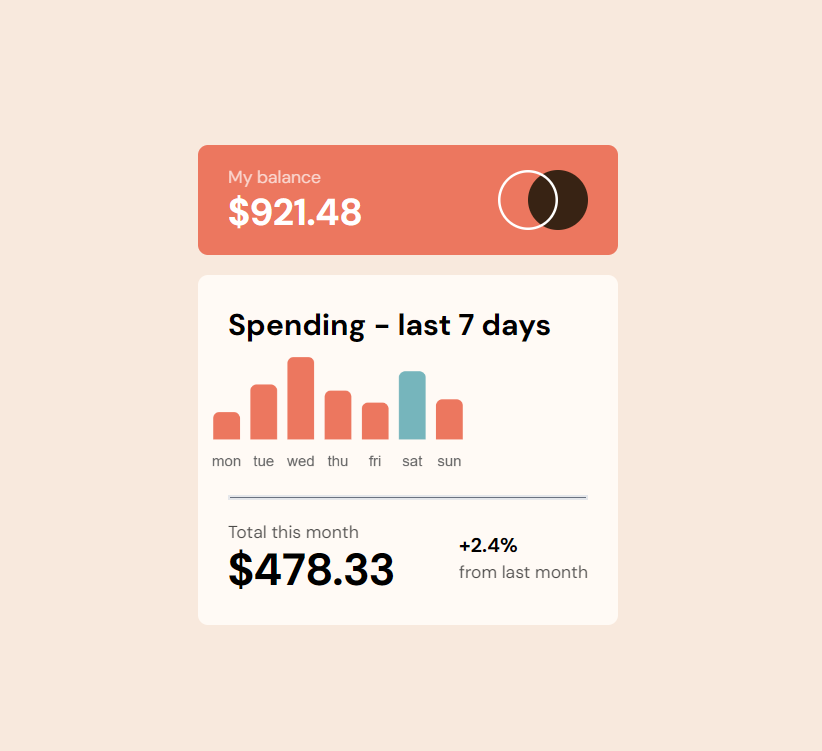
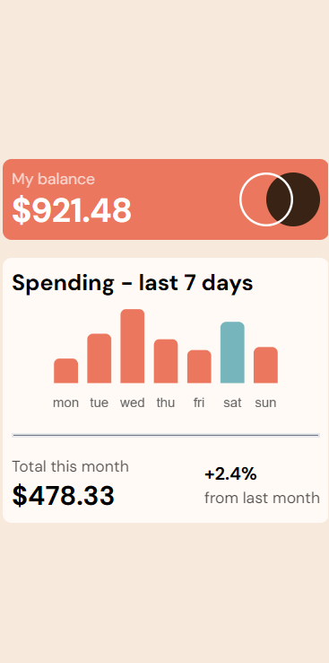

# Frontend Mentor - Expenses chart component solution

This is a solution to the [Expenses chart component challenge on Frontend Mentor](https://www.frontendmentor.io/challenges/expenses-chart-component-e7yJBUdjwt). Frontend Mentor challenges help you improve your coding skills by building realistic projects. 

## Table of contents

- [Overview](#overview)
  - [The challenge](#the-challenge)
  - [Screenshot](#screenshot)
  - [Links](#links)
- [My process](#my-process)
  - [Built with](#built-with)
  - [What I learned](#what-i-learned)
  - [Useful resources](#useful-resources)
- [Author](#author)
- [Acknowledgments](#acknowledgments)

## Overview

### The challenge

Users should be able to:

- View the bar chart and hover over the individual bars to see the correct amounts for each day.✅
- See the current day’s bar highlighted in a different colour to the other bars.✅
- View the optimal layout for the content depending on their device’s screen size.✅
- See hover states for all interactive elements on the page.✅
- **Bonus**: Use the JSON data file provided to dynamically size the bars on the chart.✅

### Screenshot

### Links

- Solution URL: [https://www.frontendmentor.io/solutions/responsive-page-of-chart-component-PoFYUfX-A4](https://www.frontendmentor.io/solutions/responsive-page-of-chart-component-PoFYUfX-A4)
- Live Site URL: [https://omyadav-chart-component.netlify.app](https://omyadav-chart-component.netlify.app)

## My process

### Built with

- Semantic HTML5 markup
- CSS custom properties
- Flexbox
- Mobile-first workflow
- Chart.js package
- [React](https://reactjs.org/) - JS library
- [TailwindCss](https://tailwindcss.com/) - For styles

### what I learned

- how to write a bargraph syntax 
- how to customize chart component from Chart.js library📊
- how to use ref hook in react.js 
- how to use a date object in js
- how to use try/catch block  

### Useful Resources

#### Chart.js package 

- install command (npm i chart.js )

## Author

- Frontend Mentor - [@OmYadav3](https://www.frontendmentor.io/profile/OmYadav3)
- Twitter - [@omyadav_3](https://twitter.com/Omyadav_3)

## Acknowledgements

-Thanks to my friend [@Akash](https://github.com/aakashjangra) for helping me and reminding the map function functionality.